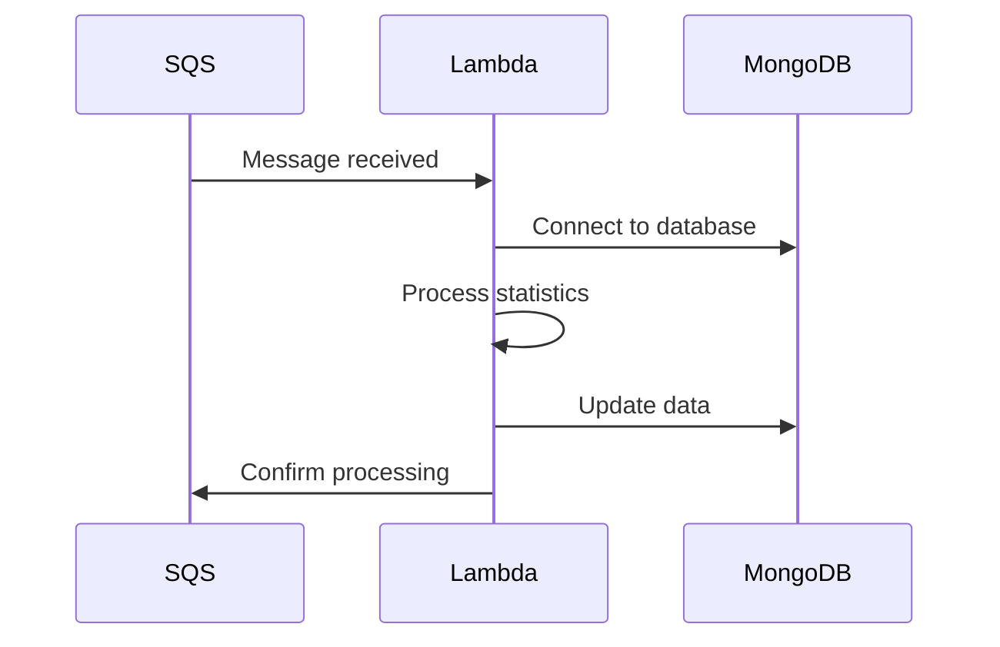

# System Architecture

## Architecture Overview

The system is built as a serverless worker that processes messages from an SQS queue to create and update teams in leagues. The architecture follows an asynchronous processing pattern with the following characteristics:

1. **Asynchronous Processing**
   - Messages are received via SQS
   - Background processing
   - Automatic retry on failures

2. **Data Persistence**
   - MongoDB as the main database
   - Separate collections for teams and statistics
   - Optimized indexes for frequent queries

3. **Scalability**
   - Lambda functions for processing
   - Automatic scaling based on load
   - Configurable timeout per function

## Main Components

### 1. AWS Lambda Function
- **Runtime**: Node.js 18.x
- **Timeout**: 600 seconds
- **Memory**: Configurable
- **Handler**: `handler.handler`

### 2. SQS Queue
- **Name**: `processar-players-statistics-team`
- **Type**: Standard Queue
- **Retention**: 14 days
- **Visibility Timeout**: 900 seconds

### 3. MongoDB
- **Connection**: URI via environment variables
- **Collections**:
  - `teams`
  - `player_statistics`
  - `leagues`

## Processing Flows

### 1. Message Reception


### 2. Statistics Processing
1. Receive message from queue
2. Extract player data
3. Process statistics
4. Update team in league
5. Confirm processing

### 3. Error Handling
- Automatic retry on failures
- Detailed logs in CloudWatch
- Critical error notifications

## Infrastructure Configuration

### Serverless Framework
```yaml
service: league-create-teams-worker
provider:
  name: aws
  runtime: nodejs18.x
  timeout: 600
  memorySize: 1024
```

### Environment Variables
```env
MONGODB_USERNAME=your_username
MONGODB_PASSWORD=your_password
DATABASE=database_name
```

## Monitoring and Logs

### CloudWatch
- Execution logs
- Performance metrics
- Configurable alerts

### Main Metrics
- Processing time
- Success rate
- Errors by type
- Memory usage

## Security

### Authentication
- MongoDB credentials via environment variables
- IAM roles for AWS
- Layered security

### Data
- In-transit encryption
- Automatic backup
- Data validation 