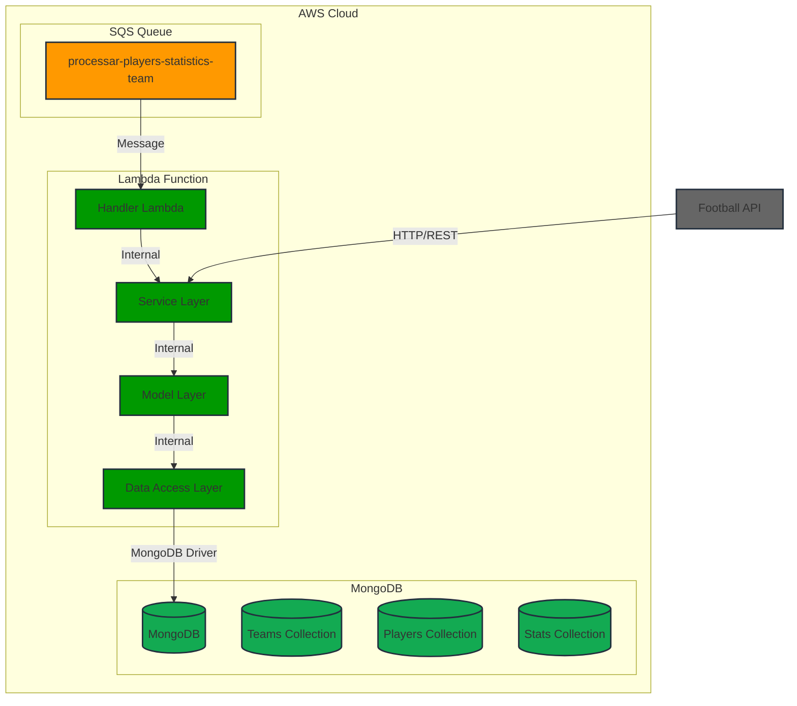
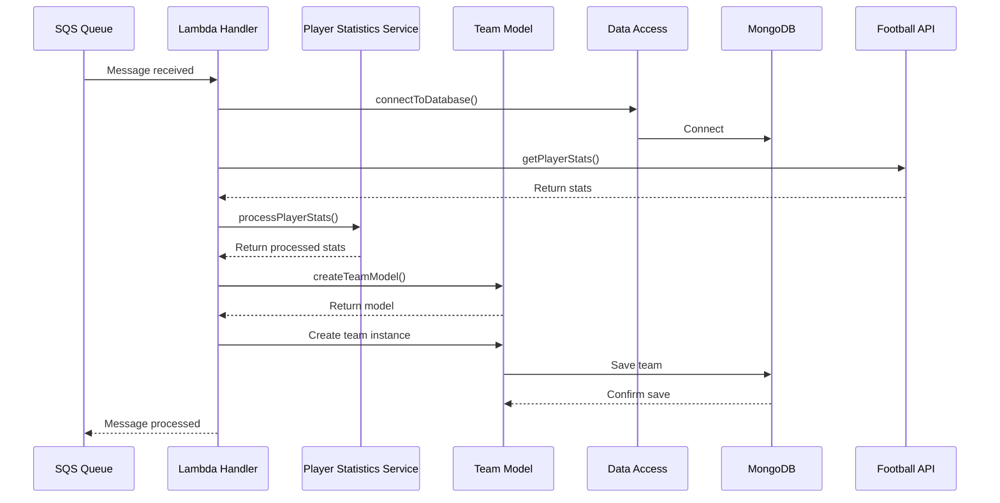
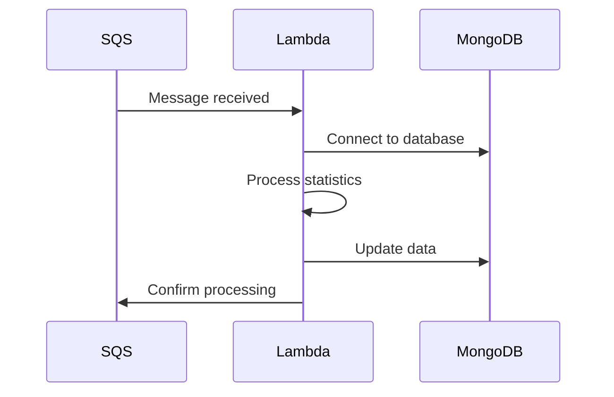

# System Architecture

## Overview

The League Create Teams Worker is a serverless service responsible for processing player statistics and creating teams in leagues. It follows a serverless architecture using AWS Lambda as the main function, with well-defined layers to ensure separation of responsibilities and maintainability.

## Architecture Diagram



## Sequence Diagram



## System Layers

### 1. API Layer (api/)
- Responsible for external service integration
- Implements communication with the football API
- Manages HTTP requests

### 2. Data Access Layer (data-access/)
- Manages MongoDB connection
- Implements CRUD operations in the database
- Abstracts data access complexity

### 3. Model Layer (model/)
- Defines data structure
- Implements basic business rules and validations
- Creates dynamic models based on team ID

### 4. Service Layer (service/)
- Implements main business logic
- Processes player statistics
- Manages team creation rules

### 5. Handler Layer (handler.js)
- Lambda function entry point
- Processes SQS messages
- Coordinates flow between different layers

## Data Flow
1. SQS message received by Lambda
2. Handler processes message and extracts parameters
3. Service layer coordinates business logic
4. Data Access layer persists data
5. Response is returned to SQS

## Security Considerations
- Credentials stored in environment variables
- Input data validation
- Error and exception handling

## Scalability
- Serverless architecture enables automatic scaling
- MongoDB connections managed efficiently
- Asynchronous team processing

## Architecture Overview

The system is built as a serverless worker that processes messages from an SQS queue to create and update teams in leagues. The architecture follows an asynchronous processing pattern with the following characteristics:

1. **Asynchronous Processing**
   - Messages are received via SQS
   - Background processing
   - Automatic retry on failures

2. **Data Persistence**
   - MongoDB as the main database
   - Separate collections for teams and statistics
   - Optimized indexes for frequent queries

3. **Scalability**
   - Lambda functions for processing
   - Automatic scaling based on load
   - Configurable timeout per function

## Main Components

### 1. AWS Lambda Function
- **Runtime**: Node.js 18.x
- **Timeout**: 600 seconds
- **Memory**: Configurable
- **Handler**: `handler.handler`

### 2. SQS Queue
- **Name**: `processar-players-statistics-team`
- **Type**: Standard Queue
- **Retention**: 14 days
- **Visibility Timeout**: 900 seconds

### 3. MongoDB
- **Connection**: URI via environment variables
- **Collections**:
  - `teams`
  - `player_statistics`
  - `leagues`

## Processing Flows

### 1. Message Reception


### 2. Statistics Processing
1. Receive message from queue
2. Extract player data
3. Process statistics
4. Update team in league
5. Confirm processing

### 3. Error Handling
- Automatic retry on failures
- Detailed logs in CloudWatch
- Critical error notifications

## Infrastructure Configuration

### Serverless Framework
```yaml
service: league-create-teams-worker
provider:
  name: aws
  runtime: nodejs18.x
  timeout: 600
  memorySize: 1024
```

### Environment Variables
```env
MONGODB_USERNAME=your_username
MONGODB_PASSWORD=your_password
DATABASE=database_name
```

## Monitoring and Logs

### CloudWatch
- Execution logs
- Performance metrics
- Configurable alerts

### Main Metrics
- Processing time
- Success rate
- Errors by type
- Memory usage

## Security

### Authentication
- MongoDB credentials via environment variables
- IAM roles for AWS
- Layered security

### Data
- In-transit encryption
- Automatic backup
- Data validation 