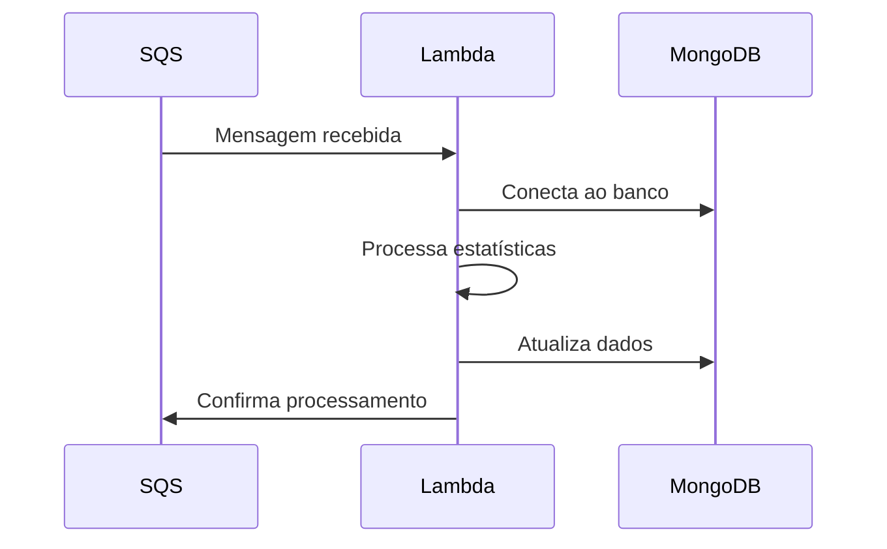

# Arquitetura do Sistema

## Visão Geral da Arquitetura

O sistema é construído como um worker serverless que processa mensagens de uma fila SQS para criar e atualizar times em ligas. A arquitetura segue um padrão de processamento assíncrono com as seguintes características:

1. **Processamento Assíncrono**
   - Mensagens são recebidas via SQS
   - Processamento em background
   - Retry automático em caso de falhas

2. **Persistência de Dados**
   - MongoDB como banco de dados principal
   - Coleções separadas para times e estatísticas
   - Índices otimizados para consultas frequentes

3. **Escalabilidade**
   - Funções Lambda para processamento
   - Escalamento automático baseado em carga
   - Timeout configurável por função

## Componentes Principais

### 1. AWS Lambda Function
- **Runtime**: Node.js 18.x
- **Timeout**: 600 segundos
- **Memória**: Configurável
- **Handler**: `handler.handler`

### 2. SQS Queue
- **Nome**: `processar-players-statistics-team`
- **Tipo**: Standard Queue
- **Retention**: 14 dias
- **Visibility Timeout**: 900 segundos

### 3. MongoDB
- **Conexão**: URI via variáveis de ambiente
- **Coleções**:
  - `teams`
  - `player_statistics`
  - `leagues`

## Fluxos de Processamento

### 1. Recebimento de Mensagem


### 2. Processamento de Estatísticas
1. Recebe mensagem da fila
2. Extrai dados do jogador
3. Processa estatísticas
4. Atualiza time na liga
5. Confirma processamento

### 3. Tratamento de Erros
- Retry automático em falhas
- Logs detalhados no CloudWatch
- Notificação de erros críticos

## Configurações de Infraestrutura

### Serverless Framework
```yaml
service: league-create-teams-worker
provider:
  name: aws
  runtime: nodejs18.x
  timeout: 600
  memorySize: 1024
```

### Variáveis de Ambiente
```env
MONGODB_USERNAME=seu_usuario
MONGODB_PASSWORD=sua_senha
DATABASE=nome_do_banco
```

## Monitoramento e Logs

### CloudWatch
- Logs de execução
- Métricas de performance
- Alertas configuráveis

### Métricas Principais
- Tempo de processamento
- Taxa de sucesso
- Erros por tipo
- Uso de memória

## Segurança

### Autenticação
- Credenciais MongoDB via variáveis de ambiente
- IAM roles para AWS
- Segurança em camadas

### Dados
- Criptografia em trânsito
- Backup automático
- Validação de dados 